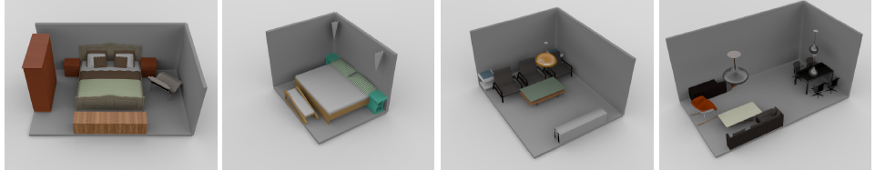

# Sync2Gen
Code for ICCV 2021 paper: [Scene Synthesis via Uncertainty-Driven Attribute Synchronization](https://arxiv.org/abs/2108.13499)

<div align="center">
  
</div>

## 0. Environment
Environment: `python 3.6` and `cuda 10.0` on Ubuntu 18.04
- Pytorch 1.4.0
- tensorflow 1.14.0 (for tensorboard)

## 1. Dataset
```
├──dataset_3dfront/
    ├──data
        ├── bedroom
            ├── 0_abs.npy
            ├── 0_rel.pkl
            ├── ...
        ├── living
            ├── 0_abs.npy
            ├── 0_rel.pkl
            ├── ...
        ├── train_bedroom.txt
        ├── train_living.txt
        ├── val_bedroom.txt
        └── val_living.txt
```
See [3D-FRONT Dataset](./dataset_3dfront/README.md) for dataset generation.

## 2. VAE

### 2.1 Generate scenes from random noises
Download the pretrained model from [https://drive.google.com/file/d/1VKNlEdUj1RBUOjBaBxE5xQvfsZodVjam/view?usp=sharing](https://drive.google.com/file/d/1VKNlEdUj1RBUOjBaBxE5xQvfsZodVjam/view?usp=sharing)
```
Sync2Gen
└── log
    └── 3dfront
        ├── bedroom
        │   └── vaef_lr0001_w00001_B64
        │       ├── checkpoint_eval799.tar
        │       └── pairs
        └── living
            └── vaef_lr0001_w00001_B64
                ├── checkpoint_eval799.tar
                └── pairs
```

```
type='bedroom'; # or living
CUDA_VISIBLE_DEVICES=0 python ./test_sparse.py  --type $type  --log_dir ./log/3dfront/$type/vaef_lr0001_w00001_B64 --model_dict=model_scene_forward --max_parts=80 --num_class=20 --num_each_class=4 --batch_size=32 --variational --latent_dim 20 --abs_dim 16  --weight_kld 0.0001  --learning_rate 0.001 --use_dumped_pairs --dump_results --gen_from_noise --num_gen_from_noise 100
```
The predictions are dumped in `./dump/$type/vaef_lr0001_w00001_B64`

### 2.2 Training
To train the network:
```
type='bedroom'; # or living
CUDA_VISIBLE_DEVICES=0 python ./train_sparse.py --data_path ./dataset_3dfront/data  --type $type  --log_dir ./log/3dfront/$type/vaef_lr0001_w00001_B64  --model_dict=model_scene_forward --max_parts=80 --num_class=20 --num_each_class=4 --batch_size=64 --variational --latent_dim 20 --abs_dim 16  --weight_kld 0.0001  --learning_rate 0.001
```

## 3. Bayesian optimization
```
cd optimization
```
### 3.1 Prior generation
See [Prior generation](./optimization/README.md).

### 3.2 Optimization
```
type=bedroom # or living;
bash opt.sh $type vaef_lr0001_w00001_B64  EXP_NAME
```
We use [Pytorch-LBFGS](https://github.com/hjmshi/PyTorch-LBFGS) for optimization.

### 3.3 Visualization
There is a simple visualization tool:
```
type=bedroom # or living
bash vis.sh $type vaef_lr0001_w00001_B64 EXP_NAME
```

The visualization is in `./vis`. `{i:04d}_2(3)d_pred.png` is the initial prediction from VAE. `{i:04d}_2(3)d_sync.png` is the optimized layout after synchronization.

## Acknowledgements
The repo is built based on:
- [VoteNet](https://github.com/facebookresearch/votenet)
- [Pytorch-LBFGS](https://github.com/hjmshi/PyTorch-LBFGS)

We thank the authors for their great job.

## Contact
If you have any questions, you can contact Haitao Yang (yanghtr [AT] outlook [DOT] com).


